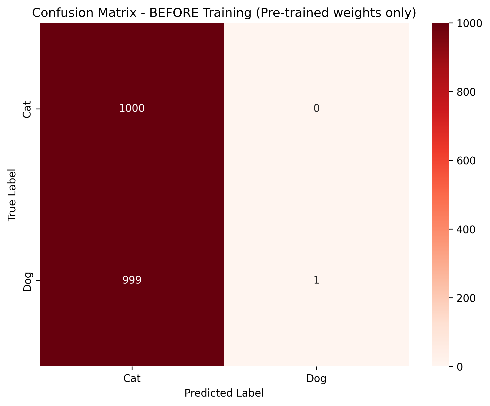
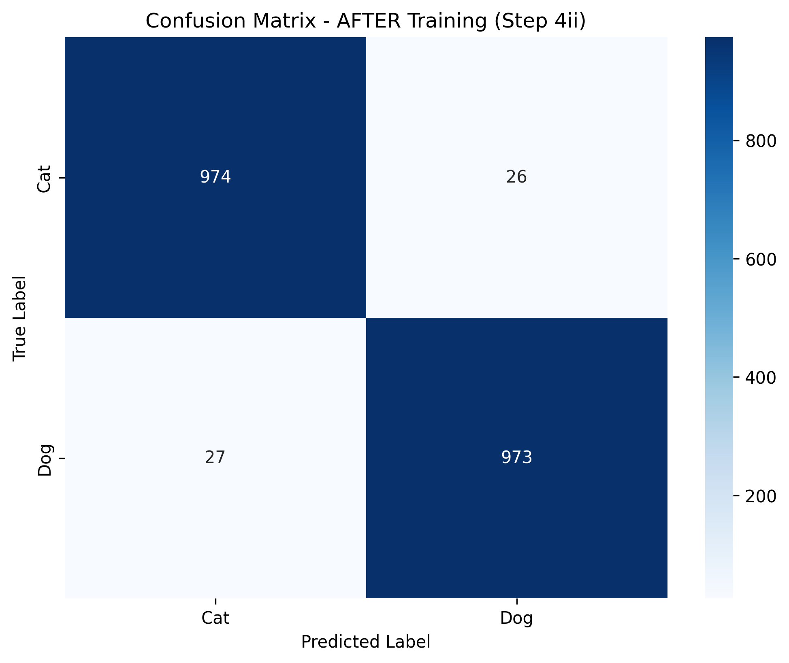
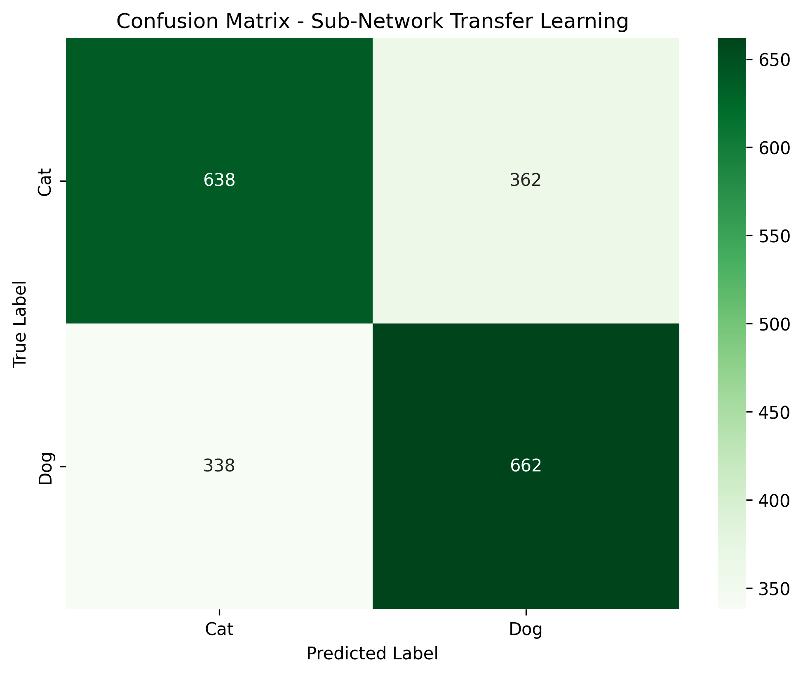

# CS 4/510 Programming Assignment #3: Transfer Learning

## My experiments
It took me quite a while to get this assignment done since it turns out there are a lot of prerequisites to use the tensorflow on my computer.
First real big issue that I ran into was that I had to install the tensorflow version 2.12.0, since the latest version 2.14.0 is not compatible with my RTX 5080 GPU.
Then I had to install the correct version of CUDA and CUDNN, which took me a while to figure out. It then took even more time to figure out that I just couldn't use the GPU at all, since it is not compatible with the tensorflow version 2.12.0. I ended up using the CPU for the training, which is was slow but it worked. Hopefully I'd be able to use my GPU at some point in the future.
```python
# Force TensorFlow to use CPU only to avoid RTX 5080 compatibility issues
import o
os.environ['CUDA_VISIBLE_DEVICES'] = '-1'  
```

As for what I did for the assignment, I basically paste the instructions from the assignment into my code and then tried to break each step down into its own little code block. I'm following a format that I used for a computer vision class. Thats why my code is broken down into different functions since it kinda works as a jupyter notebook. From there I just followed the instructions step by step more or less iteratively, when I got stuck like for what function did what I used bpython interpreter to see the functions/class, its pretty useful for that. 


## Step 4: Results

### (i) Pre-training Evaluation
  
Test Accuracy: 50.05%

### (ii) Full Transfer Learning
  
Test Accuracy: 97.35%

### (iii) Sub-network Transfer Learning
  
Test Accuracy: 65.00%

**Improvements:**
- Pre-training to full training: +47.30%
- Full network vs sub-network: +32.35%

## Summary

| Approach                | Accuracy  |
|-------------------------|-----------|
| Pre-trained only        | 50.05%    |
| Full transfer learning  | 97.35%    |
| Sub-network (100 layers)| 65.00%    |

Transfer learning achieved 97.35% accuracy by training only a small fraction of the total parameters, demonstrating the effectiveness of pre-trained features for domain-specific tasks.